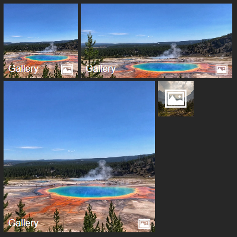

# react-metro-brick
Grids arranged in Metro way.

Visual [docs](https://demching.github.io/react-metro-brick) and [demo](https://demching.github.io/react-metro-brick/demo.html)

## Bricks


4 brick sizes available: `small` (1 x 1), `medium` (2 x 2), `wide` (4 x 2) and `large` (4 x 4).

11 themes available: `red`, `green`, `amber`, `orange`, `blue`, `cobalt`, `cyan`, `purple`, `teal`, `dark` and `yellow`.



Custom image can be used in background too.

## Installation
```
npm i react-metro-brick

// or with yarn
yarn add react-metro-brick
```

## Usage - Brick

To create a simple brick, simply import `Brick` and provide parameters.
```jsx
import { Brick } from 'react-metro-brick';

<Brick size='wide' theme='dark' />
```

__Brick Parameters__
Property | Type | Required | Remarks
--- | --- | --- | ---
`size` | `string` | No | `small` \| `medium` (default) \| `wide` \| `large`
`theme` | `string` | No | `red` \| `green` \| `amber` \| `orange` \| `blue` \| `cobalt` \| `cyan` (default) \| `purple` \| `teal` \| `dark` \| `yellow`
`bkg` | `string` | No | URL of the background image.
`name` | `string` | No | Name displayed.
`icon` | `React.ReactNode` | No | Icon displayed at the center.<br>`string` value will be treated as an image url.
`badge` | `React.ReactNode` | No | Small badge displayed next to the `name`.<br> `number` value > 99 will change to `99+`.
`msg` | `Message[]` | No | Array of messages.
`msgDelay` | `number` | No | All messages display duration in millisecond.<br>Default `5000`.
`href` | `string` | No | Make the brick as link and set its destination.
`divProps` | `React.HTMLProps` | No | Other DIV properties.<br>e.g. id, style, onClick
`fill` | `boolean` | No | Specify to create an empty block.
`standalone` | `boolean` | No | __Required__ if it is __NOT__ placed in `BrickContainer`.

If specify property `msg`, the brick will switch to each message every 5 second.

__Message Parameters__
Property | Type | Required | Remarks
--- | --- | --- | ---
`title` | `string` | No | Message title.
`body` | `React.ReactNode` | No | Message body.
`delay` | `number` | No | Message display duration in millisecond.<br>Set `msgDelay` in `Brick` instead if you want to apply to all messages.<br>Inherited from the brick `msgDelay` if not specified.
`theme` | `string` | No | Different theme to this message.<br>Inherited from the brick if not specified.
`bkg` | `string` | No | Different background image to this message.<br>Inherited from the brick if not specified.

## Usage - BrickContainer


`BrickContainer` is a grid layout for `Brick`. Each row contains 6 columns by default. You can arrange the `Brick` easily.

You can use `BrickContainer` in two ways:
```jsx
import { Brick, BrickContainer } from 'react-metro-brick';

// Directly add Bricks as children
<BrickContainer name='Brick Group'>
    <Brick size='large' theme='dark' />
    <Brick size='medium' theme='red' />
    <Brick size='medium' theme='teal' />
</BrickContainer>


// or create an JSON array with configurations of each Brick
<BrickContainer name='Brick Group' bricks={[
    {size: 'large', theme: 'dark'},
    {size: 'medium', theme: 'red'},
    {size: 'medium', theme: 'teal'}
]}></BrickContainer>
```

__BrickContainer Parameters__
Property | Type | Required | Remarks
--- | --- | --- | ---
`size` | `string` | No | `small` (4 columns) \| `medium` (6 columns) (default) \| `wide` (8 columns) \| `large` (12 columns)
`columns` | `number` | No | Set exact number of columns. Override `size`.
`name` | `string` | No | Name of this group.
`bricks` | `Brick[]` | No | JSON configuration of each brick.
`divProps` | `React.HTMLProps` | No | Other DIV properties.<br>e.g. id, style, onClick
`children` | `React.ReactNode` | No | Anything to place after `bricks`.<br>If specified with `divProps.children`, this will be placed first.

All the bricks inside the container always try to fill every gap. You may find that the smaller bricks are arranged in a differnt order.

4 `small` bricks would form a `4 x 1` group instead of `2 x 2`. You may need to rearrange the order of the bricks to meet your needs.

If you intend to leave some gap, you can create a empty brick by specify `fill = true`.

To easily add multiple gaps, you can specify `prepend` / `append` in the JSON configuration of a `Brick`. It __DOES NOT__ work when specify in `<Brick />` directly.

__`prepend` / `append` Parameters__
`count` | `number` | Yes | Number of empty bricks to create
`size` | `string` | No | Size of empty bricks

## License
Release under [MIT](LICENSE) License

## Donate
If you find this repo useful, please share to your friends. Or you can buy me a coffee:

<a href="https://www.buymeacoffee.com/demching" target="_blank"></a>